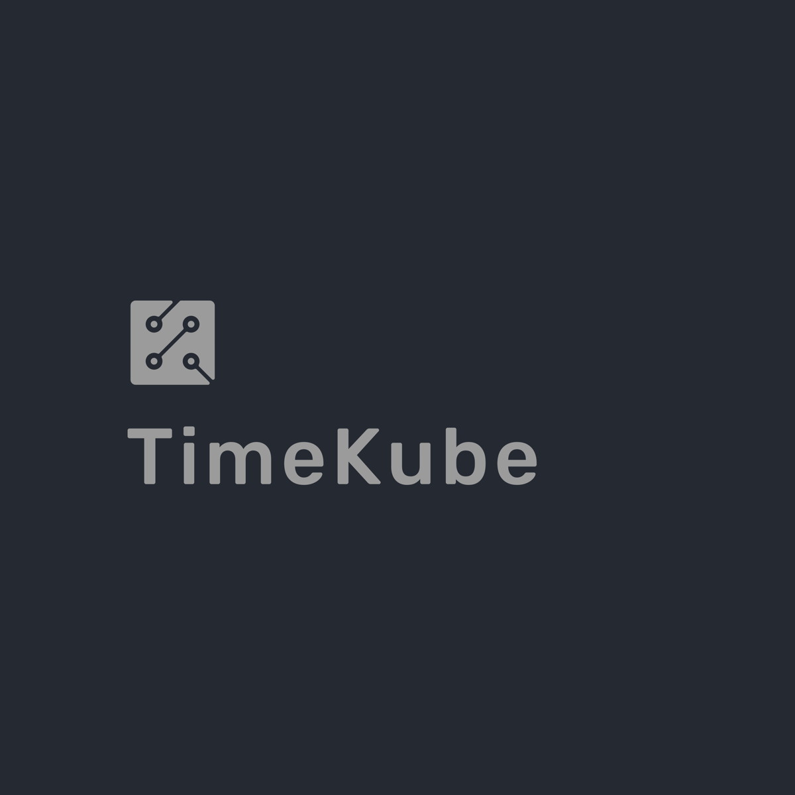

# TimeKube 

<p>
  
</p>

TimeKube is a K8s cluster "Time Machine" graphical user interface that is able to take snapshots of a cluster’s state. 

## Table of Contents

- [Introduction](#introduction)
- [Features](#features)
- [Installation](#installation)
- [Usage](#usage)
- [Contributing](#contributing)
- [License](#license)

## Introduction

Explain what your project does, why it exists, and its main goals. Provide a brief overview of the key features.

## Features

List the main features of your project. You can include a bullet-point list or a table.

- Feature 1
- Feature 2
- Feature 3

## Installation

Provide step-by-step instructions on how to install your project. Include any dependencies that need to be installed and any configuration that needs to be done.

```bash
# Example installation steps
git clone https://github.com/yourusername/yourproject.git
cd yourproject
npm install
