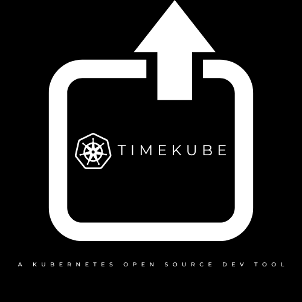

# TimeKube 

<p>
  
</p>

TimeKube: A K8s cluster 'Time Machine' UI for seamless backup and snapshot management of Kubernetes states.

## Table of Contents

- [Introduction](#introduction)
- [Features](#features)
- [Installation](#installation)
- [Usage](#usage)
- [Contributing](#contributing)
- [License](#license)

## Introduction


"TimeKube simplifies Kubernetes (K8s) cluster management through its user-friendly graphical interface. As a 'Time Machine' for K8s, the project exists to streamline backup processes and enable effortless snapshots of cluster states. Its main goals include enhancing user convenience and control in K8s operations.

Key Features:

- User-friendly graphical interface
- Seamless backup and snapshot management for K8s clusters
- Streamlined Kubernetes operations for enhanced user control"
- Visualization of kubernetes nodes, pods, volumes, metrics etc.
## Features

1. User-Friendly Graphical Interface:

  - TK offers an intuitive and easy graphical user interface designed for a positive user experience.
2. Backup Operations:

  - TimeKube facilitates seamless backup operations for Kubernetes (K8s) clusters in different time intervals - Daily, Weekly, Monthly, Annual.
3. Snapshot Management:

  - The tool enables the effortless capture of snapshots (visualization) of K8s cluster states.

## Installation

Provide step-by-step instructions on how to install your project. Include any dependencies that need to be installed and any configuration that needs to be done.

```bash
# Example installation steps
git clone https://github.com/yourusername/yourproject.git
cd yourproject
npm install
